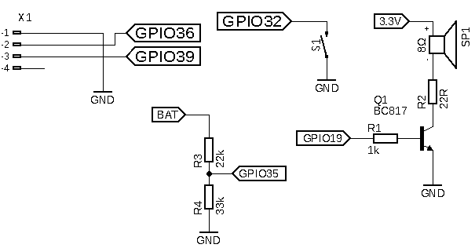

# Gadająca suwmiarka na ESP32 (talking calipers)

## Disclaimer (for non-Polish users)

Synthesizer used in this project is specific to Polish language.
Please, do not ask me to add English/Russian/Chinese speech.

## Kilka uwag

W projekcie użyto kodu pochodzącego z następujących źródeł

* Odczyt i dekodowanie suwmiarki: <https://github.com/MGX3D/EspDRO>
* Audio: <https://github.com/earlephilhower/ESP8266Audio>
* Synteza mowy: <https://github.com/ethanak/ESP8266-Lektor>

Program został przetestowany z suwmiarką Vorel. Nie gwarantuję działania
z innymi suwmiarkami.

Wtyczka i szczegóły połączenia z suwmiarką - patrz <https://github.com/MGX3D/EspDRO>

Można wydrukować mniejszą wtyczkę z pliku w katalogu connector. Ustawienia druku:

* Materiał - TPU
* Średnica dyszy - 0.4 mm
* Wysokość warstwy - 0.1 mm
* Wysokość pierwszej warstwy - 0.2 mm

Zmniejszona wtyczka pasuje wyłącznie do suwmiarki Vorel!

## I kilka słów o projekcie

Projekt przeznaczony jest przede wszystkim dla osób niewidomych i słabo widzących,
ale może być przydatny również w przypadkach, gdy sposób pomiaru utrudnia lub
uniemożliwia odczyt wyświetlacza.

Projekt jest opracowany z myślą o umieszczeniu całości na suwmiarce (z tyłu za wyświetlaczem),
bez żadnych kabli łączących suwmiarkę z wolnostojącym urządzeniem lub komputerem.

Program umożliwia odczyt zarówno w milimetrach, jak i calach. W tym drugim przypadku
precyzja ograniczona jest do 1 mil (co prawda suwmiarka podaje dane z precyzją 0.5 mil, ale
mechaniczna dokładność suwmiarki czyni taką precyzję bezsensowną, a niepotrzebnie
wydłużałaby wypowiadaną kwestię). Program automatycznie rozpoznaje w jakich jednostkach
suwmiarka przekazuje dane (zgodnie z przełącznikiem inch/mm suwmiarki).

Program dodaje jednostkę (cale/milimetry) wyłącznie przy pierwszym pomiarze lub
po zmianie jednostki. W trakcie wykonywania pomiarów odczyt w milimetrach zawiera
dwie cyfry po przecinku, odczyt w calach trzy, co pozwala łatwo rozpoznać jednostkę
w której pracuje suwmiarka.

Program może pracować w trzech trybach:

* Odczyt zmian - program odczytuje wartość tylko jeśli się zmieniły lub po naciśnięciu klawisza
* Odczyt na żądanie - program odczytuje wartość po naciśnięciu klawisza
* Odczyt ciągły - program odczytuje dane cały czas w odstępach sekundowych

Przełączanie odbywa się poprzez dłuższe (powyżej pół sekundy) wciśnięcie klawisza. Tryb jest anonsowany
po każdej zmianie.

Podwójne wciśnięcie klawisza odczytuje stan baterii.

Proponowany schemat połączeń:



Tranzystor dowolny NPN o prądzie przełączania min. 0.2A. W oryginalnym urządzeniu
użyłem BC817.
Zamiast głośnika 8Ω i rezystora R2 można zastosować wysokoomowy głośnik (np. 60Ω).

Jeśli mowa jest za cicha, można zwiększyć CONTRAST_LEVEL na początku pliku audio.cpp - uzyteczne
wartości to od 0.1 do 1.0. Zwiększanie wartości powoduje zwiększenie głośności kosztem wzrostu
zniekształceń (bez zwiększania amplitudy).

Możliwe jest również użycie dowolnego smartfona lub tabletu z systemem Android jako syntezatora mowy.
W tym celu na urządzeniu z Androidem należy zainstalować aplikację Suwspiker.apk (z katalogu Android).
Aby uruchomić bluetooth w suwmiarce, należy podczas włączania trzymać wciśnięty przycisk. Po pierwszym
uruchomieniu należy sparować suwmiarkę ze smartfonem!

Większość parametrów dodatkowych można ustawić łącząc się za pomocą kabla USB
i dowolnego terminala (prędkość 115200). Polecenie ```help``` spowoduje wypisanie
wszystkich poleceń, polecenie ```help <polecenie>``` spowoduje wypisanie
pomocy dla konkretnego polecenia. Np.

```help synth```

wypisze pomoc dla polecenia ```synth``` (podłączenie zewnętrznego syntezatora)

Zdjęcia i film z użycia na forum Forbot.pl: <https://forbot.pl/forum/topic/19875-gadajaca-suwmiarka/>
