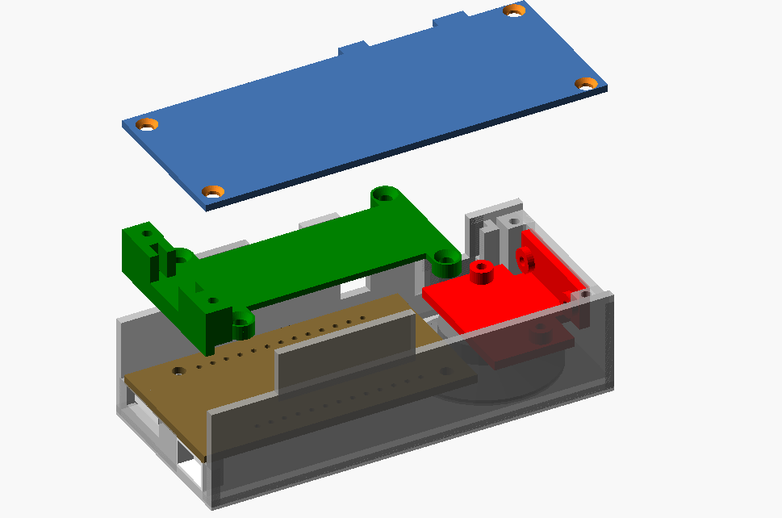
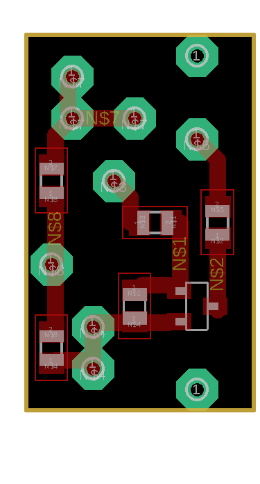

# Przykładowa konstrukcja

Ustawienia wydruku:
* Wysokość warstwy 0.2 mm
* Wysokość pierwszej warstwy 0.3 mm
* Wypełnienie 20%
* Skirt (bez raftu czy brimu)
* Supporty tylko dla elementu "przekladka"

Śruby M2x5mm z łbem stożkowym wkręcane bezpośrednio w przyhotowane otwory.

Użyte elementy:
* Wemos LOLIN32 LITE
* Akumulator Akyga 450 mAh 45x30x4mm
* Tact Switch 6x6mm 2-pinowy
* Przełącznik miniaturowy suwakowy 9x3.5x3.5 mm raster 2.54mm
* Miniaturowy głośnik 27mm
* Tranzystor BC817-40
* Rezystory 805

Płytkę należy przykręcić do uchwytu głośnika. Przełącznik i przycisk można wlutować w kawałki płytki uniwersalnej przyciuętej tak, aby pasowała do prowadnic w obudowie.

Po złożeniu i przetestowaniu należy obudowę przykleić do suwmiarki taśmą dwustronną zgodnie ze zdjęciem.
Polecam użycie pasków typu "Tesa Powerstrips".

